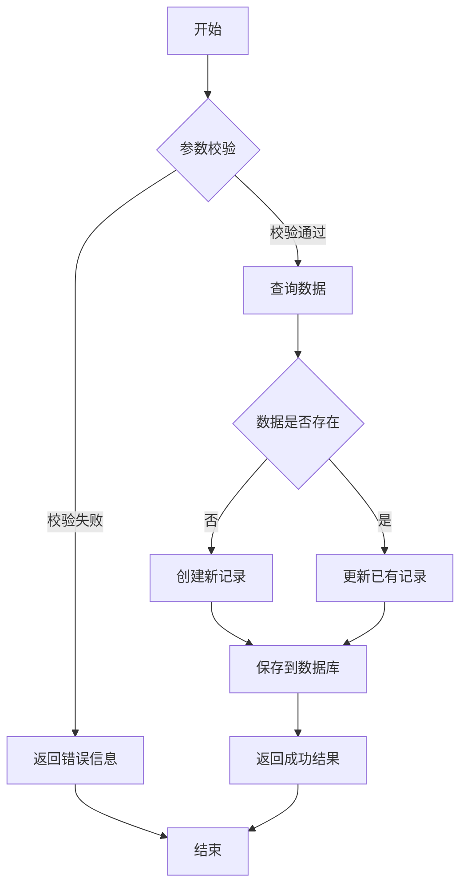
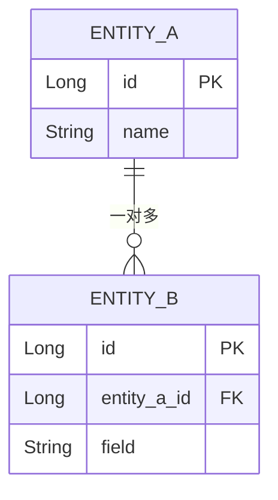

# Detailed Design Document Generator

## Overview

Generates comprehensive detailed design documents (in Markdown format, convertible to Word) for CEAM backend modules. Given a module description, this skill systematically reads the codebase, extracts architecture information, and produces a structured design document.

## When to Use

**Use this skill when:**
- Creating detailed design documents for a new or existing module
- Writing technical specification documents that need interface design, flowcharts, and data structures
- Generating Word-ready design documentation from source code
- User mentions "detailed design", "detailed design doc", "detailed design document"

**Don't use for:**
- API interface documentation only (use docs-management skill)
- General code documentation or comments
- User guides or tutorials

## Input Requirements

The user should provide the following information:

| Item | Required | Description |
|------|----------|-------------|
| Module name | Yes | The module to document (e.g., "monitor", "alarm", "agent") |
| Module description | Yes | Brief description of the module's purpose |
| Scope | No | Specific features or classes to focus on (defaults to entire module) |
| Output path | No | Document output location (defaults to `docs/design/`) |

## Workflow

### Step 1: Parse Input and Explore Codebase

1. Parse user-provided module name and description
2. Explore the codebase to find all relevant files:
   - Controller classes: `src/main/java/**/controller/{module}/**/*.java`
   - Service classes: `src/main/java/**/service/{module}/**/*.java`
   - Repository classes: `src/main/java/**/repository/{module}/**/*.java`
   - Entity classes: `src/main/java/**/entity/{module}/**/*.java`
   - DTO classes: `src/main/java/**/dto/{module}/**/*.java`
   - VO classes: `src/main/java/**/vo/{module}/**/*.java`
   - Enum classes: `src/main/java/**/enums/**/*{Module}*.java`
3. Read all identified files to understand the module's architecture

### Step 2: Analyze Module Structure

From the codebase exploration, extract:

1. **Entity analysis**: Fields, relationships, table names
2. **Service analysis**: Business methods, transaction boundaries, dependencies
3. **Controller analysis**: REST endpoints, request/response types
4. **DTO/VO analysis**: Data transfer structures
5. **Enum analysis**: Status codes, type definitions

### Step 3: Generate Document

Generate the detailed design document following the template below. The document must include all four sections:

1. Module Functional Description
2. Interface Design
3. Processing Flow (pseudocode + Mermaid flowcharts)
4. Data Structures

**文档篇幅控制规则（强制）**：

- 整篇文档控制在 **1500 行以内**
- 接口设计仅写概览表，不写每个接口的详细请求参数、请求体 JSON、响应 JSON、错误码表
- 处理流程只写**核心业务方法**（有复杂校验/多表操作/跨服务调用的方法），简单 CRUD 方法跳过
- 一次性使用 Write 工具写入，避免多次 Edit 拼接
- 如果预估内容超过 1500 行，优先精简接口概览表（合并同类接口）和处理流程（合并相似逻辑）

### Step 4: Save Document

1. Generate filename: `yyyy-MM-dd-{module-name}-detailed-design.md`
2. Save to `docs/design/` directory
3. Report completion to user

### Step 5: Export to Word（可选）

设计文档保存后，可以使用 `md-to-docx` skill 将内容插入到 Word 详细设计说明书中：

1. 确认前置依赖已安装：pandoc、python-docx、officecli
2. 调用 `md-to-docx` skill，指定目标 Word 文档和目标章节
3. md-to-docx 会自动处理：去除前言/目录/附录、转换格式、修复表格边框、包装代码块、修复标题样式

**快速示例**：
```
请使用 md-to-docx skill，将 docs/design/2026-04-16-xxx-detailed-design.md
插入到 dylan.docx 的 "3.2. 后端模块设计（于勇）" 章节下
```

---

## Document Template

```markdown
# {Module Chinese Name} 模块详细设计文档

**Author**: Dylan
**创建时间**: {yyyy-MM-dd}
**最后更新**: {yyyy-MM-dd}
**版本**: v1.0
**状态**: 草稿

---

## 目录

- [1. 模块功能描述](#1-模块功能描述)
- [2. 接口设计](#2-接口设计)
- [3. 处理流程](#3-处理流程)
- [4. 数据结构](#4-数据结构)
- [5. 附录](#5-附录)

---

## 1. 模块功能描述

### 1.1 模块概述

{模块的整体描述，包括模块的定位、核心功能和业务价值}

### 1.2 功能列表

| 功能编号 | 功能名称 | 功能描述 | 优先级 |
|---------|---------|---------|--------|
| F001 | {功能名称} | {功能描述} | 高/中/低 |

### 1.3 业务规则

| 规则编号 | 规则名称 | 规则描述 | 适用场景 |
|---------|---------|---------|---------|
| R001 | {规则名称} | {规则描述} | {适用场景} |

### 1.4 模块依赖

| 依赖模块 | 依赖方式 | 说明 |
|---------|---------|------|
| {模块名} | {调用/数据/事件} | {说明} |

---

## 2. 接口设计

### 2.1 接口概览

| 接口编号 | 接口名称 | 请求方法 | 接口路径 | 说明 |
|---------|---------|---------|---------|------|
| API-001 | {接口名称} | GET/POST/PUT/DELETE | /api/v1/{path} | {说明} |

> **注意**: 接口设计仅写概览表，不写每个接口的详细请求/响应内容。详细的接口参数和响应体请参考对应的 API 接口文档（`docs/interface/` 目录）。

---

## 3. 处理流程

### 3.1 {流程名称}

#### 3.1.1 流程说明

{流程的业务背景和目的}

#### 3.1.2 伪代码

```
FUNCTION {functionName}({params}):
    // 1. 参数校验
    IF {param} IS NULL THEN
        RETURN error("参数不能为空")
    END IF

    // 2. 业务处理
    {business logic pseudocode}

    // 3. 数据持久化
    {persistence pseudocode}

    // 4. 返回结果
    RETURN success(result)
END FUNCTION
```

#### 3.1.3 流程图



### 3.2 {另一流程名称}

{重复 3.1 结构}

---

## 4. 数据结构

### 4.1 实体类

#### 4.1.{N} {EntityName}

**对应表名**: `{table_name}`

| 字段名 | 数据库列名 | 类型 | 必填 | 说明 |
|-------|-----------|------|------|------|
| id | id | Long | 是 | 主键（雪花算法） |
| {field} | {column} | {type} | 是/否 | {说明} |
| createTime | create_time | Date | 是 | 创建时间 |
| updateTime | update_time | Date | 是 | 更新时间 |
| dbid | dbid | Long | 是 | 数据库标识 |
| createBy | create_by | String | 是 | 创建人 |
| updateBy | update_by | String | 是 | 更新人 |
| systemId | system_id | Long | 是 | 系统ID |

**ER 关系图**



### 4.2 DTO / VO / Request 对象

#### 4.2.{N} {DTO/VO/RequestName}

**用途**: {对象用途描述}

| 字段名 | 类型 | 必填 | 说明 |
|-------|------|------|------|
| {field} | {type} | 是/否 | {说明} |

### 4.3 枚举类

#### 4.3.{N} {EnumName}

**用途**: {枚举用途描述}

| 枚举值 | 名称 | 说明 |
|-------|------|------|
| {VALUE} | {name} | {说明} |

---

## 5. 附录

### 5.1 术语表

| 术语 | 说明 |
|------|------|
| {term} | {说明} |

### 5.2 参考文档

- [关联接口文档](../interface/{filename})
- [数据库设计文档]({link})

### 5.3 变更记录

| 版本 | 日期 | 变更内容 | 变更人 |
|------|------|---------|--------|
| v1.0 | {yyyy-MM-dd} | 初始版本 | Dylan |

---

**文档维护人**: Dylan
**最后更新**: {yyyy-MM-dd}
**版本**: v1.0
```

---

## Writing Guidelines

### Functional Description Section

1. Start from the user-provided description, then enrich with code analysis
2. Each function should map to one or more Service methods
3. Business rules should be extracted from validation logic in Service classes
4. Module dependencies should be extracted from `@Autowired` injections and cross-module calls

### Interface Design Section

1. **仅写接口概览表**，不写每个接口的详细请求参数、请求体、响应体内容
2. 接口概览表按 Controller 分组，每行包含：接口编号、接口名称、请求方法、接口路径、简要说明
3. 详细的接口参数和响应体由 `docs/interface/` 目录下的 API 接口文档覆盖，详细设计文档中不重复
4. Extract endpoints from `@RequestMapping`, `@GetMapping`, `@PostMapping`, etc. annotations

### Processing Flow Section

1. **Each core Service method should have its own flow subsection**
2. Pseudocode rules:
   - Use uppercase for keywords: `IF`, `THEN`, `ELSE`, `END IF`, `FOR`, `END FOR`, `RETURN`, `FUNCTION`, `END FUNCTION`
   - Use descriptive variable names matching actual code
   - Include parameter validation, business logic, persistence, and return
   - Add Chinese comments for complex logic steps
3. Mermaid flowchart rules:
   - Use `flowchart TD` (top-down) as default direction
   - Use `[]` for process steps, `{}` for decisions, `(())` for start/end
   - Add labels on decision branches: `-->|条件|`
   - Keep flowcharts focused on one process per diagram
   - Use meaningful node names (not generic "step1", "step2")

### Data Structure Section

1. Extract Entity field details from JPA annotations (`@Column`, `@Table`, etc.)
2. Include base entity fields (id, createTime, updateTime, dbid, createBy, updateBy, systemId)
3. Extract relationships from `@OneToMany`, `@ManyToOne`, `@ManyToMany` annotations
4. Document DTO/VO fields with validation annotations (`@NotNull`, `@Size`, etc.)
5. Document all enum values with descriptions

---

## Word 导出兼容性

当设计文档需要通过 `md-to-docx` skill 导入到 Word 详细设计说明书时，注意以下兼容性要点：

| 内容类型 | Markdown 中 | Word 中 | 说明 |
|---------|------------|---------|------|
| Mermaid 流程图 | ` ```mermaid ``` ` 代码块 | 以文本形式保存在单列表格中 | Mermaid 语法无法在 Word 中渲染为图形。如需图形，应预渲染为 PNG |
| 伪代码 | ` ``` ``` ` 代码块 | 以代码格式保存在单列表格中 | md-to-docx 会自动包装代码块 |
| 表格 | Markdown 表格 | 带全边框的 Word 表格 | md-to-docx 会自动添加边框 |
| 附录（第 5 章） | 包含在 MD 中 | **不导入** | md-to-docx 会自动去除第 5 章及之后的内容 |
| 文档前言/尾部 | Author/Date/Version | **不导入** | md-to-docx 会自动去除 |

## 端到端流水线

```
代码分析（Step 1-2）→ 生成 MD（Step 3）→ 保存 MD（Step 4）→ [可选] 导出到 Word（Step 5）

Step 5 详情：
  去除前言/目录/附录 → Pandoc 转换 → 修复表格边框 → 包装代码块
  → python-docx 插入 → officecli 修复标题样式 → 验证 outline
```

## Common Mistakes

| Mistake | Fix |
|---------|-----|
| Writing generic descriptions without reading code | Always read source files first, extract real field names and method signatures |
| Missing base entity fields in data structure tables | Always include id, createTime, updateTime, dbid, createBy, updateBy, systemId |
| Flowchart too complex for one diagram | Split into sub-flows, one diagram per process |
| Pseudocode too close to Java syntax | Use language-agnostic pseudocode with clear comments |
| Missing error handling in flows | Always include validation and error paths in flowcharts |
| Not documenting enum values | Extract all enum constants with their descriptions |
| Writing detailed request/response for every endpoint | Only write interface overview tables; detailed API docs go in `docs/interface/` |

---

## Integration with Other Skills

- **docs-management**: Use for document naming and directory conventions
- **code-development**: Use when design doc leads to implementation work
- **md-to-docx**: Use to insert the generated Markdown design document into the master Word document. After Step 4 (Save), invoke `md-to-docx` to handle: markdown preparation, pandoc conversion, border fix, code block wrapping, content insertion, and heading style remapping

---

**Skill Version**: v1.0
**Last Updated**: 2026-04-16
**Maintained by**: Dylan
