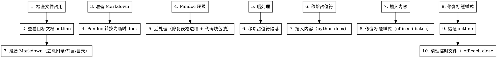

# Markdown 内容插入 Word 文档

## 概述

将 Markdown 文件的内容插入到已有 Word (.docx) 文档的指定章节中，保持文档结构和样式层级的一致性。本 Skill 经过实际验证，涵盖了从 Markdown 准备到最终验证的完整 10 步工作流。

## 前置依赖

| 工具 | 安装方式 | 用途 |
|------|---------|------|
| officecli | `irm https://raw.githubusercontent.com/iOfficeAI/OfficeCLI/main/install.ps1 \| iex` | 查看/操作 Word 文档结构 |
| pandoc | `winget install JohnMacFarlane.Pandoc` | Markdown 转 docx |
| python-docx | `pip install python-docx` | Python 操作 Word 文档 |

### Windows 环境注意事项

- **pandoc PATH 问题**: 通过 `winget` 安装后，bash 可能找不到 pandoc。解决方法：使用完整路径或 `powershell -Command "pandoc ..."`。典型路径：`C:\Users\{user}\AppData\Local\Microsoft\WinGit\Packages\JohnMacFarlane.Pandoc_*\pandoc-*\pandoc.exe`
- **officecli PATH 问题**: 类似 pandoc，安装后可能需要新终端。典型路径：`C:\Users\{user}\AppData\Local\OfficeCli\officecli.exe`
- **文件锁定**: WPS Office 比 Microsoft Word 锁文件更激进。如果 `officecli view` 报 "being used by another process"，检查是否有 WPS 打开了文件

## 端到端工作流（10 步）



---

### 步骤 1: 检查文件占用

```bash
officecli view "目标文件.docx" outline
```

若报错 `being used by another process`，提示用户关闭 Word/WPS 后重试。

### 步骤 2: 查看目标文档结构

```bash
officecli view "目标文件.docx" outline --max-lines 300
```

定位：
- **目标章节**: 要插入内容的位置（记录 paraId）
- **边界章节**: 下一个同级或上级标题（记录 paraId），插入内容不能超过此边界

```
├── [311] "后端模块设计（于勇）" (heading 2)  ← 父级章节
    ├── ...                                   ← 要替换的占位内容
├── [686] "Agent 模块" (heading 2)            ← 边界章节
```

### 步骤 3: 准备 Markdown

**关键步骤！** CEAM 详细设计文档包含多个在 Word 导出时需要去除的部分：

| 去除内容 | 标识 | 原因 |
|---------|------|------|
| YAML 前言 | 文件开头的 `---` 到第二个 `---` | Author/Date/Version 信息不需要 |
| 属性行 | `**Author**`, `**创建时间**` 等 | 同上 |
| 目录 | `## 目录` 到下一个 `---` | Word 有自己的目录机制 |
| 附录 | `## 5. 附录` 或 `## 附录` 及之后所有内容 | 不需要导入 |
| 文档尾部 | 最后一个 `---` 之后的内容（`文档维护人`/`版本`） | 不需要导入 |

**保留内容**: 仅保留第 1 章（模块功能描述）到第 4 章（数据结构）。

用 `query` 精确获取 paraId：

```bash
officecli query "目标文件.docx" 'paragraph[style=4]' --json
```

### 步骤 4: Pandoc 转换

```bash
pandoc "源文件.md" -o /tmp/temp-content.docx --from markdown --to docx
```

**重要**: Pandoc 创建的标题样式名为 `"Heading1"`, `"Heading2"` 等（大写 H，无空格），这与目标文档的样式名（数字 ID 如 `"3"`, `"4"`）不同。此问题在步骤 8 中修复。

### 步骤 5: 后处理 Pandoc 输出（新增步骤）

对 Pandoc 生成的临时 docx 执行两项后处理：

#### 5a. 修复表格边框

Pandoc 生成的表格没有边框。所有表格必须设置全边框（single, 4sz, black）：

```python
from docx.oxml.ns import qn, nsdecls
from docx.oxml import parse_xml

def fix_table_borders(doc):
    WNS = nsdecls('w')
    border_spec = {
        'top': ('single', '4', '0', '000000'),
        'bottom': ('single', '4', '0', '000000'),
        'left': ('single', '8', '0', '000000'),
        'right': ('single', '4', '0', '000000'),
        'insideH': ('single', '4', '0', '000000'),
        'insideV': ('single', '4', '0', '000000'),
    }
    for table in doc.tables:
        tbl = table._tbl
        tblPr = tbl.find(qn('w:tblPr'))
        if tblPr is None:
            tblPr = parse_xml(f'<w:tblPr {WNS}></w:tblPr>')
            tbl.insert(0, tblPr)
        existing = tblPr.find(qn('w:tblBorders'))
        if existing is not None:
            tblPr.remove(existing)
        borders_xml = f'<w:tblBorders {WNS}>'
        for name, (val, sz, space, color) in border_spec.items():
            borders_xml += f'<w:{name} w:val="{val}" w:sz="{sz}" w:space="{space}" w:color="{color}"/>'
        borders_xml += '</w:tblBorders>'
        tblPr.append(parse_xml(borders_xml))
```

#### 5b. 包装代码块

找到所有代码样式的段落（含 "code"/"source" 的 style），将每个包装在一个一行一列的带边框表格中：

```python
import copy

def wrap_code_blocks_in_tables(doc):
    WNS = nsdecls('w')
    body = doc.element.body
    paras_to_wrap = []
    for para in body.findall(qn('w:p')):
        pPr = para.find(qn('w:pPr'))
        if pPr is not None:
            pStyle = pPr.find(qn('w:pStyle'))
            if pStyle is not None:
                val = pStyle.get(qn('w:val'))
                if val and ('code' in val.lower() or 'source' in val.lower()):
                    paras_to_wrap.append(para)
    for para in paras_to_wrap:
        parent = para.getparent()
        idx = list(parent).index(para)
        tbl = parse_xml(f'<w:tbl {WNS}></w:tbl>')
        tblPr = parse_xml(
            f'<w:tblPr {WNS}>'
            '<w:tblW w:w="0" w:type="auto"/>'
            '<w:tblBorders>'
            '<w:top w:val="single" w:sz="4" w:space="0" w:color="000000"/>'
            '<w:bottom w:val="single" w:sz="4" w:space="0" w:color="000000"/>'
            '<w:left w:val="single" w:sz="4" w:space="0" w:color="000000"/>'
            '<w:right w:val="single" w:sz="4" w:space="0" w:color="000000"/>'
            '</w:tblBorders></w:tblPr>')
        tbl.append(tblPr)
        tr = parse_xml(f'<w:tr {WNS}></w:tr>')
        tc = parse_xml(f'<w:tc {WNS}></w:tc>')
        tcPr = parse_xml(
            f'<w:tcPr {WNS}><w:tcW w:w="0" w:type="auto"/>'
            '<w:tcBorders>'
            '<w:top w:val="single" w:sz="4" w:space="0" w:color="000000"/>'
            '<w:bottom w:val="single" w:sz="4" w:space="0" w:color="000000"/>'
            '<w:left w:val="single" w:sz="4" w:space="0" w:color="000000"/>'
            '<w:right w:val="single" w:sz="4" w:space="0" w:color="000000"/>'
            '</w:tcBorders></w:tcPr>')
        tc.append(tcPr)
        tc.append(copy.deepcopy(para))
        tr.append(tc)
        tbl.append(tr)
        parent.remove(para)
        parent.insert(idx, tbl)
```

### 步骤 6: 移除占位符段落

用 `officecli batch` 批量移除目标章节和边界章节之间的占位符段落。**必须使用 paraId 定位**，不要用位置索引（索引会随删除操作变化）：

```bash
officecli batch "目标文件.docx" --commands '[
  {"command":"remove","path":"/body/p[@paraId=XX1]"},
  {"command":"remove","path":"/body/p[@paraId=XX2]"}
]' --json
```

### 步骤 7: 插入内容

使用 python-docx 将后处理后的临时 docx 内容插入到目标文档：

```python
from docx import Document
import copy

target_doc = Document("目标文件.docx")
source_doc = Document("temp-content.docx")

# 找到插入位置（在描述段落之后，边界章节之前）
target_body = target_doc.element.body
source_body = source_doc.element.body

insert_after = target_body  # 定位到描述段落元素

for elem in list(source_body):
    elem_copy = copy.deepcopy(elem)
    insert_after.addnext(elem_copy)
    insert_after = elem_copy

target_doc.save("目标文件.docx")
```

也可使用同目录下的 `merge_md_to_docx.py` 脚本：

```bash
python merge_md_to_docx.py \
  --target "目标文件.docx" \
  --source /tmp/temp-content.docx \
  --section "应用系统管理" \
  --boundary "应用商店管理" \
  --heading-shift 2 \
  --style-map '{"Heading1":"3","Heading2":"4","Heading3":"5","Heading4":"6"}'
```

### 步骤 8: 修复标题样式（关键步骤！）

**这是最关键的步骤。** Pandoc 创建的标题样式（"Heading1", "Heading2" 等）与目标文档的样式 ID 不匹配。

#### 问题根因

| Pandoc 创建的样式 | 目标文档的样式 ID | 说明 |
|------------------|-----------------|------|
| `"Heading1"` | `"3"` | heading 3 级别 |
| `"Heading2"` | `"4"` | heading 4 级别 |
| `"Heading3"` | `"5"` | heading 5 级别 |
| `"Heading4"` | `"6"` | heading 6 级别 |

python-docx 中的 `adjust_heading_levels` 如果映射到 `"Heading 4"` (大写 H + 空格) 会**静默失败**，因为目标文档根本没有这个样式名。必须映射到目标文档实际的数字样式 ID。

#### 映射规则

映射取决于父级章节的标题级别：
- 在 heading 2 下插入 → shift +1 (H1→3, H2→4, H3→5, H4→6)
- 在 heading 3 下插入 → shift +2
- **必须先通过 `officecli view outline` 确认父级级别**

#### 诊断

```bash
officecli query "目标文件.docx" 'paragraph[style~=Heading]' --json
```

检查返回的 `style` 字段，确认是 `"Heading1"`, `"Heading2"` 等（即需要修复的样式）。

#### 修复

```bash
officecli batch "目标文件.docx" --commands '[
  {"command":"set","path":"/","selector":"paragraph[style=Heading1]","props":{"style":"3"}},
  {"command":"set","path":"/","selector":"paragraph[style=Heading2]","props":{"style":"4"}},
  {"command":"set","path":"/","selector":"paragraph[style=Heading3]","props":{"style":"5"}},
  {"command":"set","path":"/","selector":"paragraph[style=Heading4]","props":{"style":"6"}}
]' --json
```

> **注意**: 如果插入的段落很多（>50），officecli batch 可能需要分批执行，每批约 50 条命令。

### 步骤 9: 验证结果

```bash
officecli view "目标文件.docx" outline --max-lines 300
```

确认：
- 内容出现在正确的章节下
- 标题层级正确（heading 3/4/5/6）
- 表格有边框
- 代码块在一行一列的表格中

### 步骤 10: 清理

```bash
rm -f /tmp/temp-content.docx
officecli close "目标文件.docx"
```

---

## 批量操作指南

当需要向同一文档插入多个 Markdown 文件时（例如 5 个模块设计文档插入同一个 Word 文档），按以下顺序操作效率最高：

1. **一次性转换**: 将所有 MD 文件用 pandoc 转换为 docx
2. **批量后处理**: 对所有转换后的 docx 执行表格边框修复和代码块包装
3. **一次性移除**: 用一个 officecli batch 移除所有占位符
4. **批量插入**: 用 python-docx 依次插入所有内容
5. **一次标题修复**: 用一个 officecli batch 修复所有插入内容的标题样式
6. **一次验证**: 用 officecli view outline 验证

**不要**对每个文件执行完整的工作流（转换→后处理→插入→修复→验证），这会浪费大量的文件打开/关闭开销。

---

## 标题样式映射表（CEAM 详细设计说明书专用）

以下映射表适用于将 `detailed-design-doc` skill 生成的模块设计文档插入到 CEAM 详细设计说明书 Word 文档的场景：

| 父级章节 | 设计文档 MD 级别 | Pandoc 样式 | 目标样式 ID | 目标标题级别 |
|---------|---------------|------------|------------|------------|
| heading 2（如"后端模块设计"） | `# 模块名` | Heading1 | 3 | heading 3 |
| heading 2 | `## 1. 模块功能描述` | Heading2 | 4 | heading 4 |
| heading 2 | `### 1.1 模块概述` | Heading3 | 5 | heading 5 |
| heading 2 | `#### 3.1.1 流程说明` | Heading4 | 6 | heading 6 |

> **映射规则**: 目标样式 ID = MD 标题级别 + 父级章节级别。不同文档的映射可能不同，务必先用 `officecli query` 确认。

---

## 常见问题

| 问题 | 原因 | 解决 |
|------|------|------|
| 文件被占用 | Word/WPS 打开了文件 | 提示用户关闭后重试 |
| Python 中文匹配失败 | 终端编码问题 | 脚本开头加 `sys.stdout.reconfigure(encoding='utf-8')` |
| 内容插入到错误章节 | 同名/近似标题匹配错误 | 通过父级章节 paraId 限定范围，用 `query` 精确定位 |
| 标题层级全部错误 | Pandoc 样式与目标文档不匹配 | **必须执行步骤 8**：用 officecli batch 重新映射样式 |
| officecli resident 阻塞 | 上次操作未关闭 | `officecli close "文件.docx"` |
| pandoc 在 bash 找不到 | Windows PATH 未刷新 | 用完整路径或 `powershell -Command "pandoc ..."` |
| 标题样式映射静默失败 | python-docx 映射到不存在的样式名 | 不依赖 python-docx 的标题调整，用 officecli batch 修复 |
| Mermaid 图不显示 | pandoc 无法渲染 Mermaid 语法 | Mermaid 代码块以文本形式保存在单列表格中 |

## 注意事项

- 操作前确认用户已关闭目标 Word 文件
- 操作完成后运行 `officecli close` 释放文件锁
- 删除占位符时使用 paraId 定位，不要用位置索引（索引会随删除操作变化）
- **步骤 8（标题样式修复）不可跳过** — 这是 Pandoc 转换后最关键的修复步骤
- 不同 Word 文档的样式 ID 可能不同，每次操作前用 `officecli query` 确认

---

**Skill Version**: v2.0
**Last Updated**: 2026-04-16
**Maintained by**: Dylan
